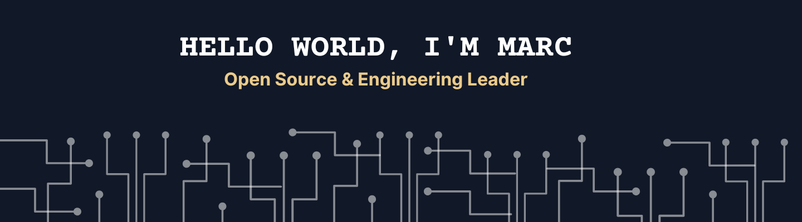

  
  

---

I'm an Open Source contributor and Chief Technology Officer at [AQVC](https://aqvc.com).

I publish a [weekly video](https://www.youtube.com/channel/UCLc-sy8yWdls3dyxMJKKblw?sub_confirmation=1) about the best open source projects I can find (suggestions welcome!).

I strongly believe in a better and **more sustainable monetization of open source** projects. 👉 Find out more [here](https://twitter.com/mfts0/status/1529866467071639552?s=20&t=OPbYsPLIPj5Z8fO3HUTK0g) and [here](https://twitter.com/mfts0/status/1491782618190266368?s=20&t=OPbYsPLIPj5Z8fO3HUTK0g)!

### Latest YouTube videos

- [Open source monetization with tea.xyz](https://www.youtube.com/watch?v=sAMrveIC0Hc)
- [A first look at Beam by PlanetScale](https://www.youtube.com/watch?v=fMrH444Bvw4)
- [Fastest Developer Environment in the Cloud (83 seconds!?)](https://www.youtube.com/watch?v=x19DetWAsVA)
- [Your NEXT modern portfolio website with Next.js](https://www.youtube.com/watch?v=r3u67UVDwzM)

### More about me:

- 🌐 See my full [about page here](https://mfts.io/about)
- 💬 Ask me about Open Source, [Next.js](https://nextjs.org), and [Ruby on Rails](https://rubyonrails.org)
- 📫 How to reach me: `marc at mfts dot io`
